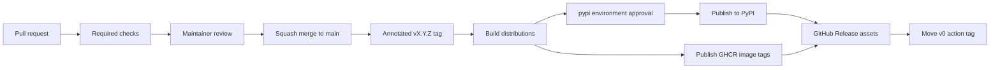

# Release process

This document describes how `docsmoke` releases are managed across PyPI,
GitHub Releases, GHCR, and the reusable GitHub Action.

## Version identifiers

`docsmoke` uses related but different versioning surfaces:

| Surface | Example | Meaning |
| ------- | ------- | ------- |
| PyPI package | `0.1.1` | Exact Python package version installed by `pip` or `pipx`. |
| GitHub Release tag | `v0.1.1` | Exact release commit and assets. The `v` prefix is a Git tag convention. |
| GitHub Action tag | `v0` | Moving major tag for the latest compatible `0.x` action release. |
| GHCR image tag | `0.1.1` | Exact container image for one release. |
| GHCR image tag | `0.1` | Moving image tag for the latest compatible `0.1.x` patch. |
| GHCR image tag | `0` | Moving image tag for the latest compatible `0.x` image. |
| GHCR image tag | `latest` | Convenience image tag for the newest release. |

Users can choose:

```yaml
# Gets compatible fixes on the 0.x line automatically.
uses: dev-ugurkontel/docsmoke@v0

# Pins the exact action release for maximum reproducibility.
uses: dev-ugurkontel/docsmoke@v0.1.1
```

`v0` is expected to move. Exact tags such as `v0.1.1` should not move after a
successful release.

## Channels

Each tagged release publishes four surfaces:

- **PyPI**: the canonical Python package for `pip`, `pipx`, and virtualenvs.
- **GitHub Releases**: wheel, sdist, CycloneDX SBOM, and Sigstore bundles.
- **GHCR**: container tags for `latest`, major, major/minor, and exact version.
- **GitHub Action**: the repository root `action.yml`, consumed through
  `uses: dev-ugurkontel/docsmoke@...`.

GitHub Packages may show the GHCR image after the first successful container
release. PyPI packages do not appear in GitHub's Packages panel because PyPI is
a separate registry.

## Release flow



## Required checks and approvals

Changes to `main` should pass:

- Python 3.10, 3.11, 3.12, and 3.13 test matrix
- Ruff lint and format checks
- mypy strict type checks
- Bandit static analysis
- 100% line and branch coverage
- Markdown link checks
- `docsmoke scan README.md docs examples`

Recommended repository settings live in [docs/REPOSITORY.md](REPOSITORY.md).

## Release steps

1. Update `pyproject.toml` with the new version.
2. Add release notes to `CHANGELOG.md`.
3. Open a pull request and wait for CI and Pages checks.
4. Merge to `main` after review.
5. Create and push the exact release tag:

   ```bash
   git tag -a vX.Y.Z -m "docsmoke vX.Y.Z"
   git push origin vX.Y.Z
   ```

6. Approve the `pypi` environment deployment when the release workflow pauses.
7. Confirm PyPI, GitHub Release assets, GHCR tags, and the moving major action
   tag.

After PyPI and GHCR publishing complete, the release workflow signs artifacts,
creates or updates the GitHub Release, and updates the major action tag
automatically:

```bash
major="${TAG%%.*}"
git tag -fa "$major" -m "Update $major to $TAG" "$GITHUB_SHA"
git push origin "refs/tags/$major" --force
```

## Failure recovery

If the release workflow fails after an exact tag has been pushed:

1. Inspect the failing job logs.
2. Fix the release workflow or packaging issue on `main` through a pull
   request.
3. Re-point the exact tag only if the failed release did not complete
   successfully.
4. Re-run the tag-triggered workflow by pushing the corrected tag.

Do not upload files manually to PyPI or GHCR unless automation is fully blocked
and the manual action is documented in `CHANGELOG.md`.

## Post-release checklist

- `gh release view vX.Y.Z` lists wheel, sdist, SBOM, and Sigstore JSON files.
- PyPI reports the new version.
- GHCR exposes `latest`, major, major/minor, and exact version tags.
- `git rev-parse v0^{commit}` matches `git rev-parse vX.Y.Z^{commit}` for
  `0.x` releases.
- `docsmoke --version` prints the released package version.
- The local tree is clean after `make clean`.
